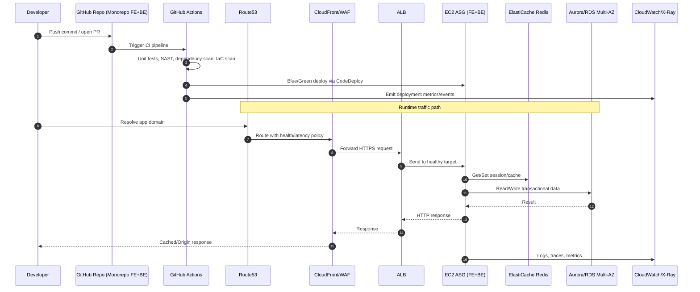

# AWS EC2 HA - Runtime + Deployment Sequence

```mermaid
sequenceDiagram
    autonumber
    participant Dev as Developer
    participant GH as GitHub Repo (Monorepo FE+BE)
    participant GHA as GitHub Actions
    participant R53 as Route53
    participant CF as CloudFront/WAF
    participant ALB as ALB
    participant EC2 as EC2 ASG (FE+BE)
    participant Redis as ElastiCache Redis
    participant DB as Aurora/RDS Multi-AZ
    participant CW as CloudWatch/X-Ray

    Dev->>GH: Push commit / open PR
    GH->>GHA: Trigger CI pipeline
    GHA->>GHA: Unit tests, SAST, dependency scan, IaC scan
    GHA->>EC2: Blue/Green deploy via CodeDeploy
    GHA->>CW: Emit deployment metrics/events

    Note over R53,DB: Runtime traffic path
    Dev->>R53: Resolve app domain
    R53->>CF: Route with health/latency policy
    CF->>ALB: Forward HTTPS request
    ALB->>EC2: Send to healthy target
    EC2->>Redis: Get/Set session/cache
    EC2->>DB: Read/Write transactional data
    DB-->>EC2: Result
    EC2-->>ALB: HTTP response
    ALB-->>CF: Response
    CF-->>Dev: Cached/Origin response
    EC2->>CW: Logs, traces, metrics
```
