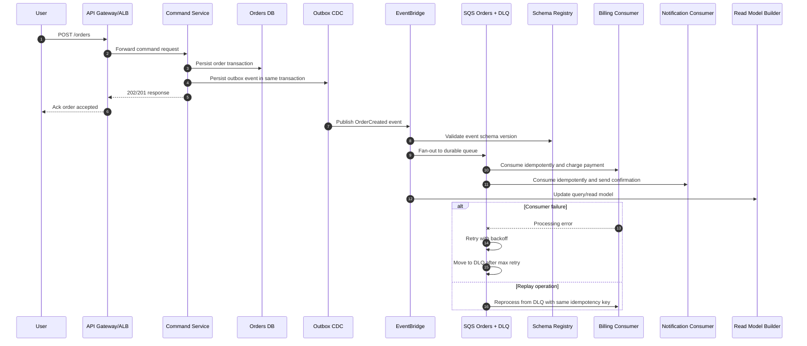

# AWS Event-Driven Microservices - Order Processing Sequence

## Staff Interview Angles

- Mention transactional outbox to avoid dual-write inconsistency.
- Explain schema versioning compatibility across producers/consumers.
- Show why replay safety depends on idempotent consumer behavior.
