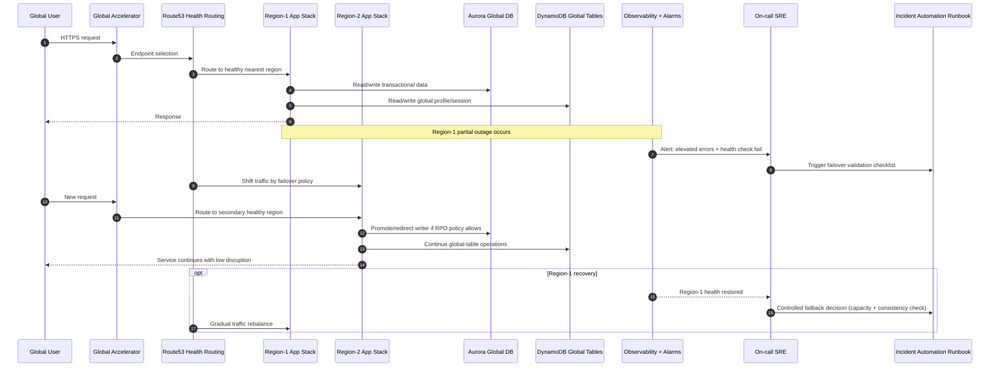

# AWS Multi-Region Active-Active - Failure and Recovery Sequence

## Architect Interview Angles

- Describe failover trigger source (health checks + SLO burn rate).
- State RTO/RPO assumptions before discussing writer promotion.
- Explain controlled failback to avoid second outage during recovery.
