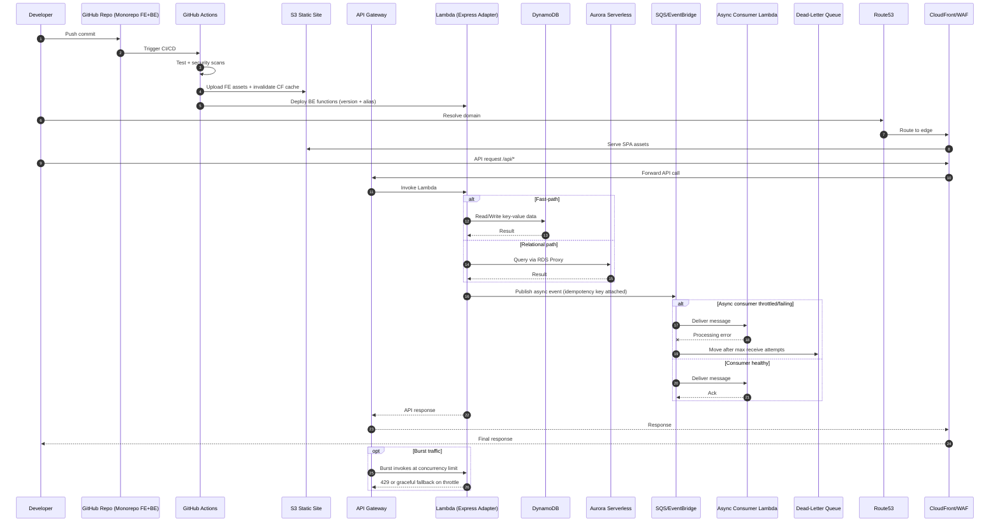

# AWS Serverless (Lambda) - Runtime + Deployment Sequence

## Staff Interview Angles

- Show where idempotency is introduced before async fan-out.
- Discuss Lambda concurrency controls and downstream protection.
- Explain DLQ replay operations and failure triage ownership.
