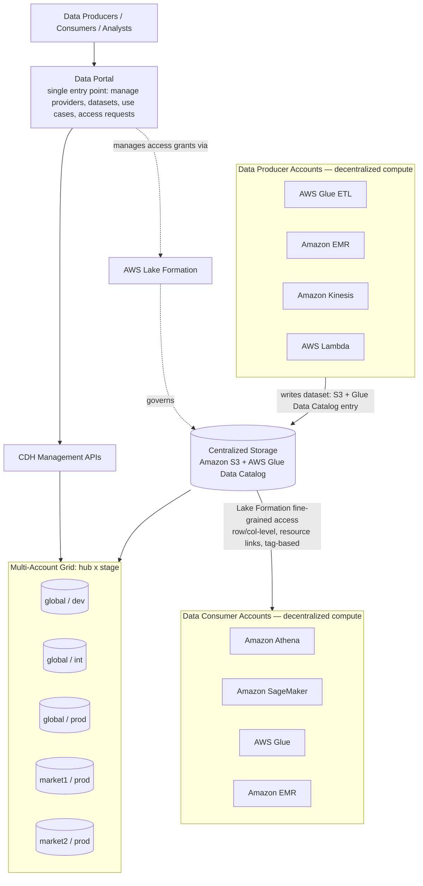
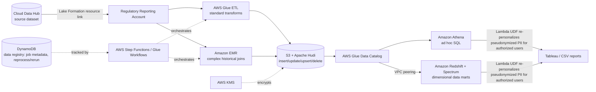
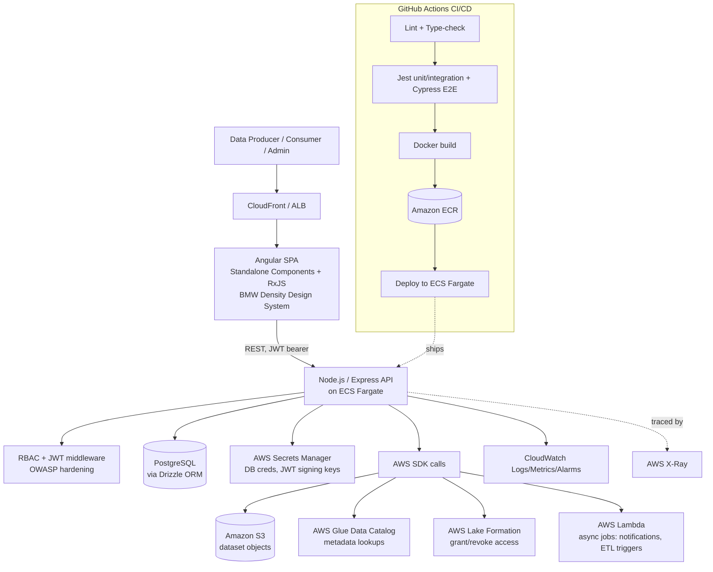
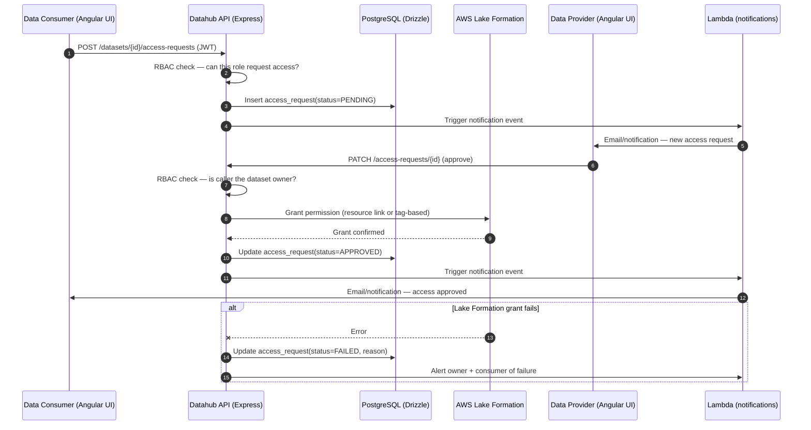

# BMW Cloud Data Hub & Datahub Portal — Diagrams (Mermaid)

Diagrams 1-2 are reconstructed from BMW/AWS's own published architecture descriptions (see `README.md` → Sources). Diagrams 3-4 model the likely architecture of the **Datahub web application** this specific role owns — labeled **(inference)** since BMW hasn't published that app's internals; it's a standard, defensible shape for the exact stack in the JD (Angular + Node/Express + PostgreSQL/Drizzle + ECS + Lambda).

## 1) Cloud Data Hub — Platform-Level Architecture (sourced)



**Talking points**
- Compute is decentralized (each producer/consumer account picks its own tools); storage conventions are centralized (S3 + Glue Data Catalog) — this is the "decentralized compute, centralized storage" principle.
- The hub × stage grid (`global/market1/market2` × `dev/int/prod`) is a one-to-many mapping to AWS accounts, isolating data by market/regulatory boundary.
- Lake Formation is the **evolution**, not the original design — it replaced an earlier bucket-level sharing + Glue Data Catalog sync-module approach that caused duplicate, filtered datasets.

---

## 2) BMW Financial Services — Regulatory Reporting (sourced, concrete use case)



**Talking points**
- PII is pseudonymized *before* it lands in CDH to satisfy GDPR/Schrems II; **Lambda UDFs inside Athena/Redshift queries** re-personalize columns only for authorized consumers at query time — pseudonymization and re-identification are kept as separate, auditable steps.
- Apache Hudi is chosen specifically because the use case needs **record-level upsert/delete**, which plain Parquet-on-S3 doesn't support well.
- A DynamoDB-backed data registry exists purely to make ETL **idempotent and re-runnable** (reprocess a failed month-end close without reprocessing everything).

---

## 3) Datahub Web Application — Likely Architecture for This Role (inference)



**Talking points**
- This is the **control-plane** application: it manages CDH metadata/access (providers, datasets, access requests) through AWS SDK calls against Glue/Lake Formation/S3 — it is not itself running Spark/EMR jobs.
- IAM roles should be scoped per ECS task (task role), never shared broad credentials; Secrets Manager holds DB credentials and JWT signing keys, rotated independently of code deploys.
- Nx monorepo (nice-to-have skill) would let the Angular app and Express API share TypeScript DTO/type definitions, eliminating an entire class of frontend/backend contract drift.

---

## 4) User Journey Sequence — "Request Access to a Dataset"



**Talking points**
- The API is the **only** writer of Lake Formation grants — the UI never talks to AWS directly, keeping IAM permissions concentrated and auditable in one service.
- Two independent RBAC checks (can-request, can-approve) model the real provider/consumer ownership split from the CDH platform design.
- Failure handling matters here precisely because this flow crosses an AWS-service boundary (Lake Formation) that can fail independently of the app's own DB — this is a natural "what if Lake Formation grant fails mid-flow" interview probe.

---

## 5) IAM & Secrets — Task Execution Role vs Task Role (inference)

```mermaid
flowchart LR
  GH[GitHub Actions] -. OIDC assumeRole .-> CIROLE[(IAM Role for CI/CD)]
  CIROLE --> ECR[(Amazon ECR)]
  CIROLE --> ECS[(ECS: register task definition & deploy)]

  subgraph Runtime[ECS Service Runtime]
    direction TB
    TE[Task Execution Role\n(ECR pull, CW logs, secrets fetch refs)]
    TR[Task Role\n(used by app code)]
    APP[Express API Container]
  end

  ECR --> Runtime
  Runtime -->|secrets| SM[Secrets Manager]
  Runtime -->|AWS SDK| S3[(S3 datasets)]
  Runtime -->|AWS SDK| GLUE[AWS Glue Catalog]
  Runtime -->|AWS SDK| LF[AWS Lake Formation]

  TE -.only-> ECR
  TE -.and-> CW[CloudWatch Logs]
  TR -.least-privilege-> S3
  TR -.least-privilege-> GLUE
  TR -.least-privilege-> LF
```

**Talking points**
- The task execution role is used by ECS for image pulls/logging; your **application never uses it** to call AWS APIs.
- The task role is what the app assumes; scope it tightly to the specific S3 prefixes and Lake Formation actions.
- Secrets are stored in Secrets Manager; the task execution role fetches them for the container at start, not the app embedding secrets in env permanently.

---

## 6) CI/CD Flow with GitHub Actions OIDC (inference)

```mermaid
flowchart TB
  PR[Pull Request] --> CI[CI: lint + type-check + tests]
  CI --> BUILD[Docker build]
  BUILD --> SIGN[Scan/Sign Image]
  SIGN --> PUSH[Push to ECR]
  PUSH --> DEPLOY[Update ECS service]
  DEPLOY --> SMOKE[Smoke tests]
  SMOKE --> PROMOTE[Promote/Tag release]

  subgraph Auth[Authentication]
    GH[GitHub Actions OIDC Token] --> STS[STS: AssumeRoleWithWebIdentity]
    STS --> ROLE[(Deploy Role with least-privilege)]
  end

  CI -.uses.-> GH
  ROLE -.permits.-> ECR[(ECR)]
  ROLE -.permits.-> ECS[(ECS)]
  ROLE -.permits.-> CW[CloudWatch (alarms update)]
```

**Talking points**
- No long-lived AWS keys in repo secrets; OIDC + STS issues short-lived credentials per workflow run.
- The deploy role only permits ECR push and ECS updates; CloudWatch alarms updates are optional but recommended.
- Smoke tests gate promotion; full E2E runs can be nightly to keep PR feedback fast.
