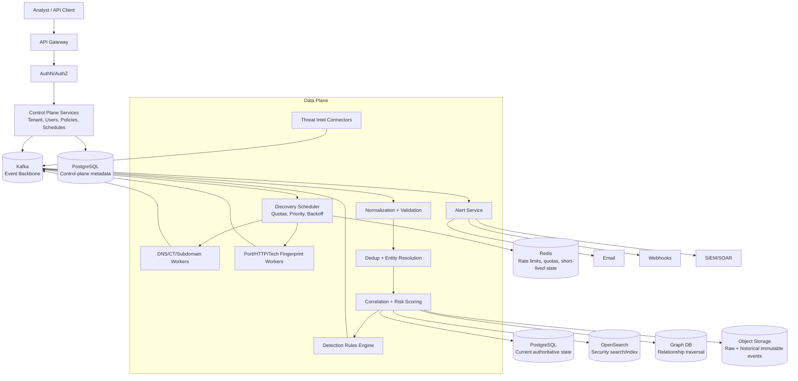
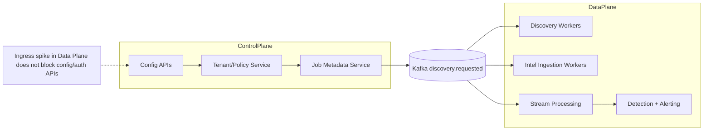
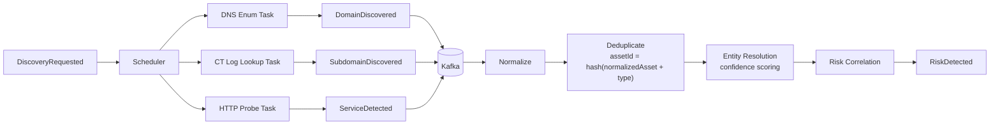
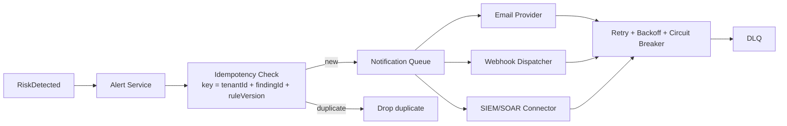
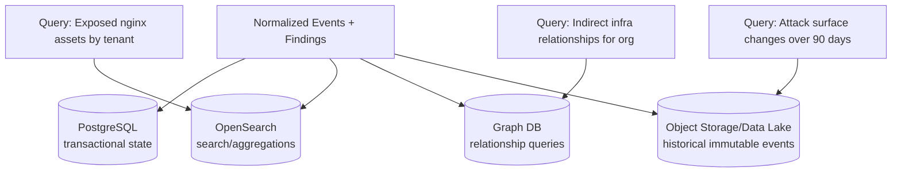

# FortiRecon HLD Diagrams (Mermaid)

## 1) End-to-End Layered Architecture

**Talking points**
- Control plane (tenant/users/policies, backed by PostgreSQL) is physically separate from the data plane (discovery, ingestion, processing) — a 100x ingestion spike cannot degrade login or config APIs.
- Kafka is the single event backbone connecting discovery, threat-intel ingestion, and the correlation pipeline — every stage is independently scalable and replayable.
- Storage is deliberately polyglot: PostgreSQL for authoritative transactional state, OpenSearch for analyst search, Graph DB for relationship traversal, object storage for immutable raw history — each chosen for the workload, not a single one-size-fits-all store.

## 2) Control Plane vs Data Plane Isolation

**Talking points**
- This is the single most important architectural decision in the whole design — isolate blast radius so a noisy/bursty data plane never starves tenant-facing control operations.
- The two planes only communicate through Kafka (`discovery.requested`), never through synchronous RPC — this keeps the coupling async and backpressure-safe.
- In a real review, this is the diagram to draw first, even before discovery internals — it signals you understand failure isolation before optimization.

## 3) Discovery and Processing Pipeline

**Talking points**
- Every discovery task type (DNS enum, CT log lookup, HTTP probe) emits its own event onto Kafka — they scale and fail independently rather than as one monolithic "scan" job.
- Deduplication happens via a deterministic `assetId = hash(normalizedAsset + type)` *before* entity resolution, so the expensive confidence-scoring step never runs twice on the same logical asset.
- Entity resolution (confidence scoring) is a distinct stage from correlation — resolving "which tenant owns this asset" is a different problem from "is this asset risky," and keeping them separate makes each independently testable.

## 4) Alerting and Idempotent Delivery

**Talking points**
- The idempotency key (`tenantId + findingId + detectionRuleVersion`) is checked *before* fan-out, not after — duplicates are dropped at the earliest point, so email/webhook/SIEM integrations never need their own dedup logic.
- Each downstream channel (email, webhook, SIEM) gets independent retry/backoff/circuit-breaker handling — one flaky webhook endpoint can't back up alerts to the other two channels.
- A DLQ is the deliberate failure boundary: after max retries, the alert is parked for replay/inspection rather than silently dropped or blocking the queue.

## 5) Storage by Workload (Polyglot)

**Talking points**
- Each store maps to a distinct access pattern: PostgreSQL answers "what is true right now," OpenSearch answers "find/aggregate across many records," Graph DB answers "how are these entities connected," object storage answers "what happened historically."
- OpenSearch and the Graph DB are **derived/projection** stores, not sources of truth — if either is lost, it can be rebuilt by replaying from PostgreSQL/object storage/Kafka retention, which is the honest answer to "what if OpenSearch goes down."
- Start lean (Phase 1 only needs PostgreSQL + OpenSearch) and introduce Graph DB/extra tiers only once a measured query pattern justifies the operational cost — a staff-level answer resists over-engineering storage upfront.
