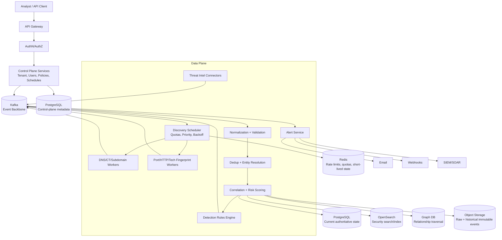
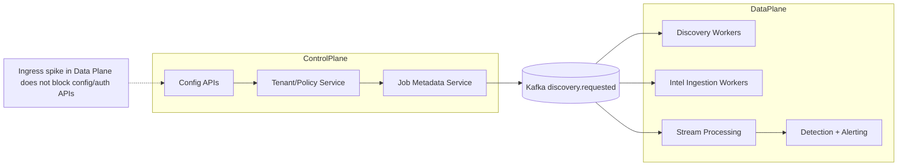
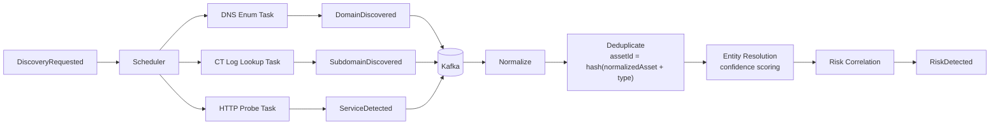
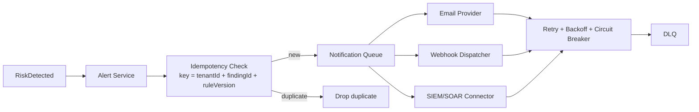
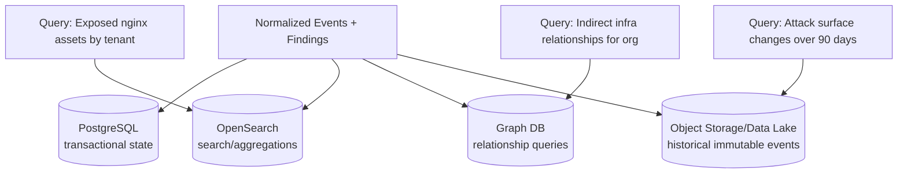

# FortiRecon HLD Diagrams (Mermaid)

## 1) End-to-End Layered Architecture

## 2) Control Plane vs Data Plane Isolation

## 3) Discovery and Processing Pipeline

## 4) Alerting and Idempotent Delivery

## 5) Storage by Workload (Polyglot)

