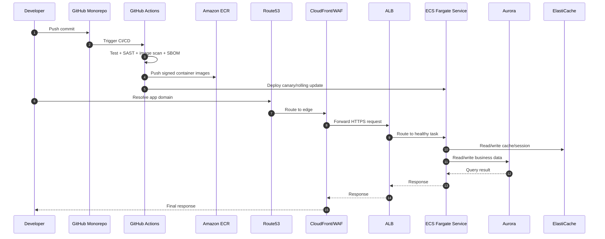

# AWS ECS Fargate HA - Runtime + Deployment Sequence

```mermaid
sequenceDiagram
    autonumber
    participant Dev as Developer
    participant GH as GitHub Monorepo
    participant GHA as GitHub Actions
    participant ECR as Amazon ECR
    participant R53 as Route53
    participant CF as CloudFront/WAF
    participant ALB as ALB
    participant ECS as ECS Fargate Service
    participant DB as Aurora
    participant Redis as ElastiCache

    Dev->>GH: Push commit
    GH->>GHA: Trigger CI/CD
    GHA->>GHA: Test + SAST + image scan + SBOM
    GHA->>ECR: Push signed container images
    GHA->>ECS: Deploy canary/rolling update

    Dev->>R53: Resolve app domain
    R53->>CF: Route to edge
    CF->>ALB: Forward HTTPS request
    ALB->>ECS: Route to healthy task
    ECS->>Redis: Read/write cache/session
    ECS->>DB: Read/write business data
    DB-->>ECS: Query result
    ECS-->>ALB: Response
    ALB-->>CF: Response
    CF-->>Dev: Final response
```
