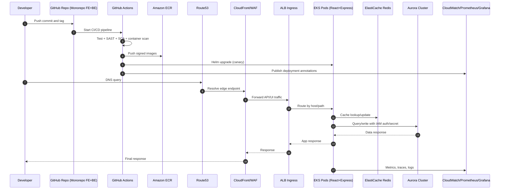

# AWS EKS Multi-AZ - Runtime + Deployment Sequence

```mermaid
sequenceDiagram
    autonumber
    participant Dev as Developer
    participant GH as GitHub Repo (Monorepo FE+BE)
    participant GHA as GitHub Actions
    participant ECR as Amazon ECR
    participant R53 as Route53
    participant CF as CloudFront/WAF
    participant ALB as ALB Ingress
    participant POD as EKS Pods (React+Express)
    participant Cache as ElastiCache Redis
    participant DB as Aurora Cluster
    participant Obs as CloudWatch/Prometheus/Grafana

    Dev->>GH: Push commit and tag
    GH->>GHA: Start CI/CD pipeline
    GHA->>GHA: Test + SAST + SCA + container scan
    GHA->>ECR: Push signed images
    GHA->>POD: Helm upgrade (canary)
    GHA->>Obs: Publish deployment annotations

    Dev->>R53: DNS query
    R53->>CF: Resolve edge endpoint
    CF->>ALB: Forward API/UI traffic
    ALB->>POD: Route by host/path
    POD->>Cache: Cache lookup/update
    POD->>DB: Query/write with IAM auth/secret
    DB-->>POD: Data response
    POD-->>ALB: App response
    ALB-->>CF: Response
    CF-->>Dev: Final response
    POD->>Obs: Metrics, traces, logs
```
