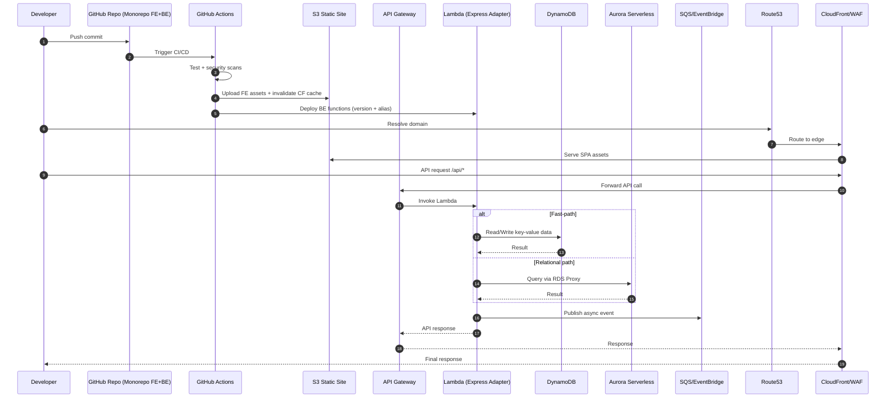

# AWS Serverless (Lambda) - Runtime + Deployment Sequence

```mermaid
sequenceDiagram
    autonumber
    participant Dev as Developer
    participant GH as GitHub Repo (Monorepo FE+BE)
    participant GHA as GitHub Actions
    participant S3 as S3 Static Site
    participant APIGW as API Gateway
    participant L as Lambda (Express Adapter)
    participant DDB as DynamoDB
    participant AUR as Aurora Serverless
    participant SQS as SQS/EventBridge
    participant R53 as Route53
    participant CF as CloudFront/WAF

    Dev->>GH: Push commit
    GH->>GHA: Trigger CI/CD
    GHA->>GHA: Test + security scans
    GHA->>S3: Upload FE assets + invalidate CF cache
    GHA->>L: Deploy BE functions (version + alias)

    Dev->>R53: Resolve domain
    R53->>CF: Route to edge
    CF->>S3: Serve SPA assets
    Dev->>CF: API request /api/*
    CF->>APIGW: Forward API call
    APIGW->>L: Invoke Lambda
    alt Fast-path
        L->>DDB: Read/Write key-value data
        DDB-->>L: Result
    else Relational path
        L->>AUR: Query via RDS Proxy
        AUR-->>L: Result
    end
    L->>SQS: Publish async event
    L-->>APIGW: API response
    APIGW-->>CF: Response
    CF-->>Dev: Final response
```
