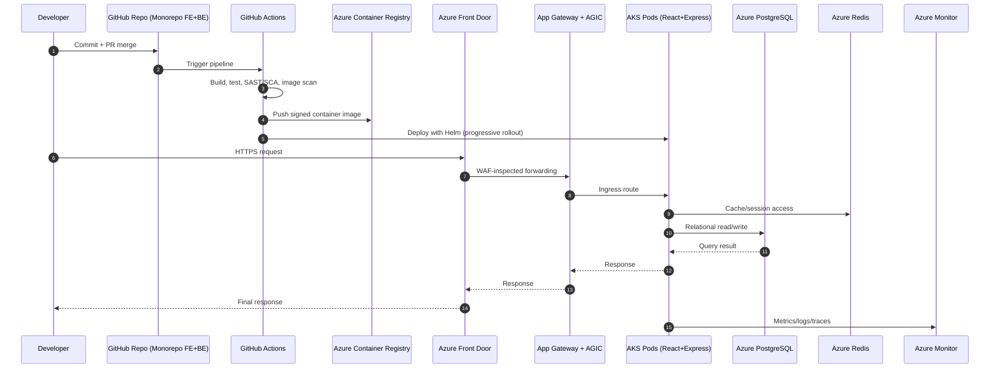

# Azure AKS Enterprise - Runtime + Deployment Sequence

```mermaid
sequenceDiagram
    autonumber
    participant Dev as Developer
    participant GH as GitHub Repo (Monorepo FE+BE)
    participant GHA as GitHub Actions
    participant ACR as Azure Container Registry
    participant FD as Azure Front Door
    participant AGW as App Gateway + AGIC
    participant AKS as AKS Pods (React+Express)
    participant PG as Azure PostgreSQL
    participant REDIS as Azure Redis
    participant MON as Azure Monitor

    Dev->>GH: Commit + PR merge
    GH->>GHA: Trigger pipeline
    GHA->>GHA: Build, test, SAST/SCA, image scan
    GHA->>ACR: Push signed container image
    GHA->>AKS: Deploy with Helm (progressive rollout)

    Dev->>FD: HTTPS request
    FD->>AGW: WAF-inspected forwarding
    AGW->>AKS: Ingress route
    AKS->>REDIS: Cache/session access
    AKS->>PG: Relational read/write
    PG-->>AKS: Query result
    AKS-->>AGW: Response
    AGW-->>FD: Response
    FD-->>Dev: Final response
    AKS->>MON: Metrics/logs/traces
```
