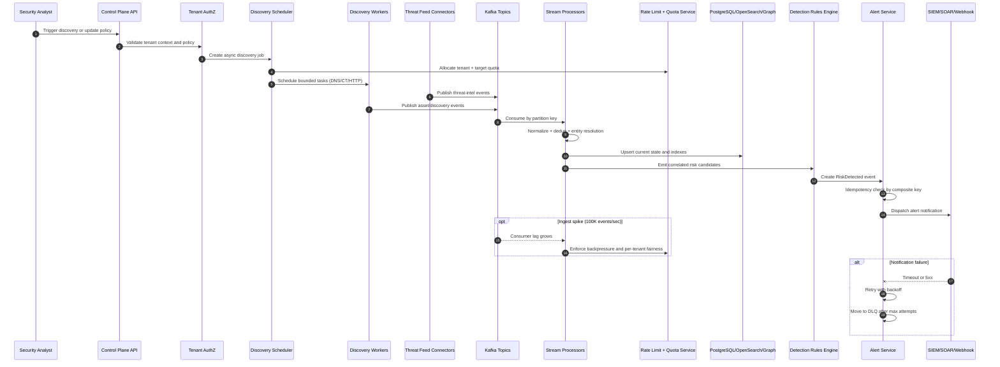

# FortiRecon EASM/DRP - Discovery to Alert Sequence

## Talking Points

- Control plane and data plane remain isolated under ingest spikes.
- Processing is asynchronous and replayable using Kafka retention.
- Detection-to-alert path is idempotent to avoid duplicate incidents.
- Notification fan-out failures are contained through retry, DLQ, and circuit breakers.
- Tenant-level quota enforcement prevents noisy-neighbor starvation.
